## Hi there I'm k0x1a4 👋

# 💫 About Me:
Fullstack Developer from Germany

# 💻 Tech Stack:
                                                                                      

# 📊 GitHub Stats:

  
  

### ✍️ Random Dev Quote

<!-- Proudly created with GPRM ( https://gprm.itsvg.in ) -->
